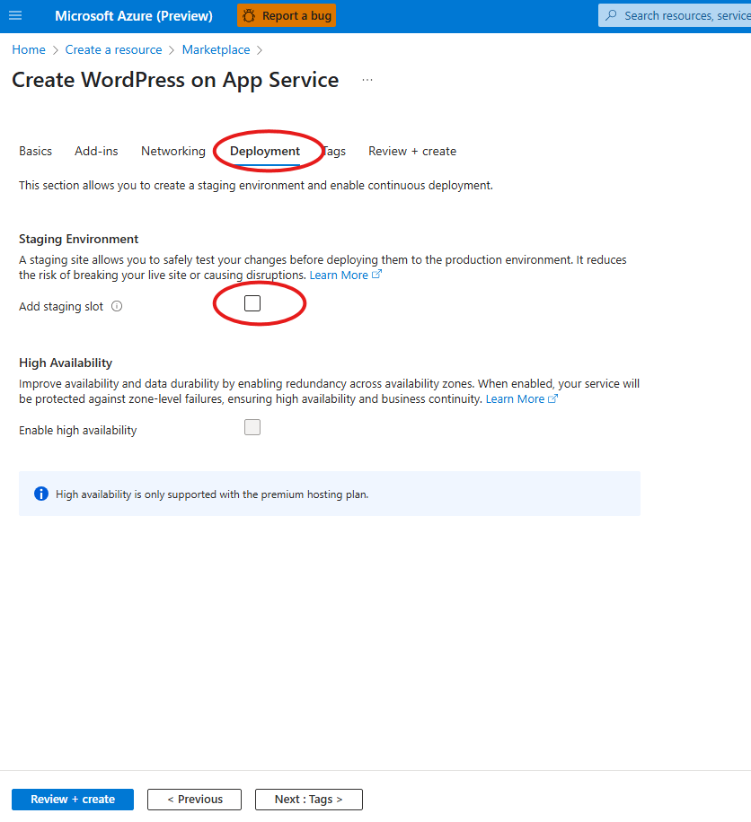
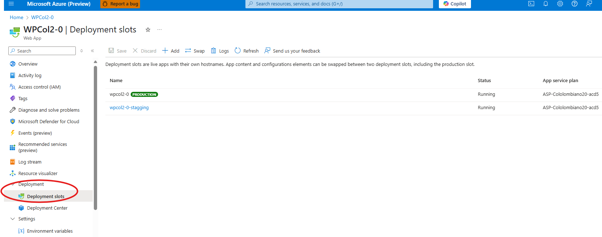
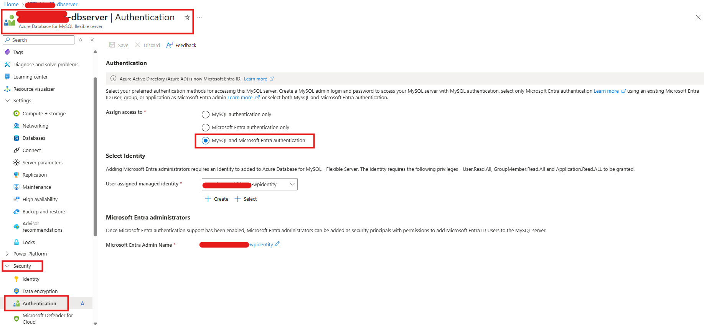
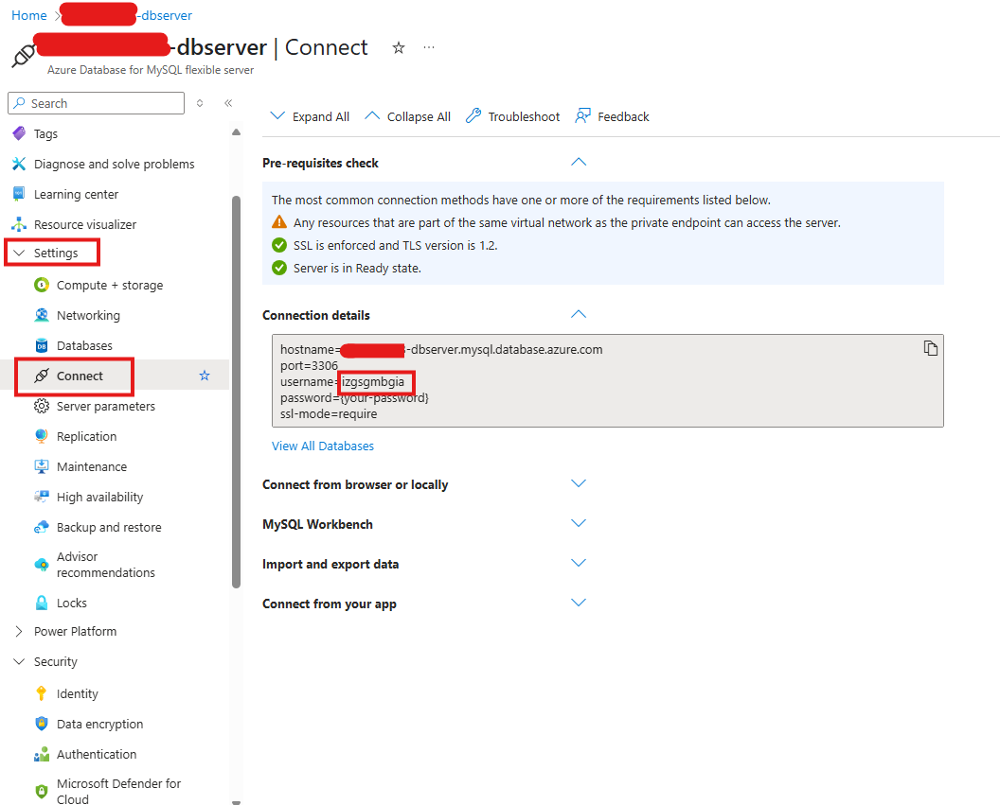
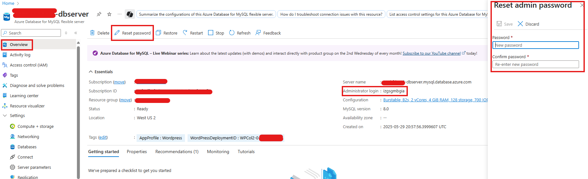
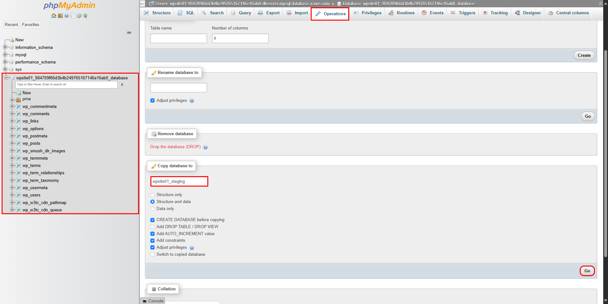
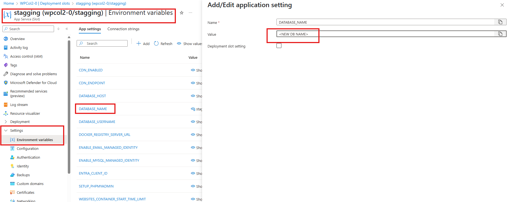
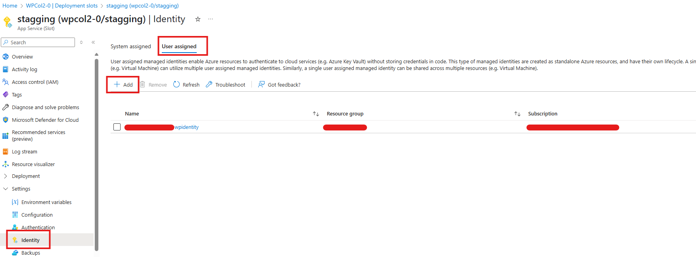

# Staging on WordPress

## 1) Create a WordPress Azure App Service with a slot

*Note: The slot can be created later as well*

Go to [https://ms.portal.azure.com/#create/WordPress.WordPress](https://ms.portal.azure.com/#create/WordPress.WordPress).  
Navigate to the **Deployment** tab and check **"Add staging slot"**. You can leave the rest of the configuration as default.

Once the app is created, you can find your slot here (you can also create new slots in this section):

By default, App Services are configured with **Managed Identity integration** and **VNET Integration**.  
If this is not already set, ensure that VNET Integration is configured for the staging slot to match the settings of the main application.

---

## Create a New Database

Create a new database inside the existing **Azure Database for MySQL Flexible Server**.  
This can be done using **phpMyAdmin** from the main application:

Go to:  
`https://<your-app>.azurewebsites.net/phpmyadmin/`

Log in using Managed Identity credentials.  
To retrieve the credentials, refer to the guide:  
[wordpress_enable_managed_identity_with_mysql.md on GitHub](https://github.com/Azure/wordpress-linux-appservice/blob/main/WordPress/wordpress_enable_managed_identity_with_mysql.md)

Refer to the section **"Retrieving access token and accessing MySQL Server"** on the official Azure GitHub repository.  
*(For an alternative, move to the next step)*

If you're having trouble accessing using Managed Identity, you can enable MySQL credentials instead:  
By default, the setting is **"Microsoft Entra authentication only"**.

To enable MySQL login:
1. Go to the database settings.
2. Change the authentication setting to allow both **Managed Identity** and **MySQL credentials**.

Retrieve the **username** from the **Connect** section or the **Overview** section (listed as *Administrator login*).

Set a new **MySQL password**.  
This change will **not affect Managed Identity** access, so the website will not experience downtime.  
Go to the **Overview** section of the database and reset the password:

Once the password is reset, try accessing **phpMyAdmin** using the new MySQL credentials.  
You should be able to log in successfully.

---

## Clone the Database

Inside **phpMyAdmin**, create the new database for the **staging slot**:

1. Go to the **Operations** tab.
2. Use the **"Copy database to"** option.
3. Enter a name for the new database.
4. Click **Go**.

---

## Link the New Database to the Staging Slot

Go to the **Environment Variables** settings for the **staging slot**, and update the `DB_NAME` (or equivalent) to match the name of the new database you just created.

Ensure that the **Managed Identity** settings of your **staging slot** match those of the **main application**.

---

With these steps complete, you should be able to access each site's **WP-Admin** and **phpMyAdmin** separately using their respective links and credentials.
